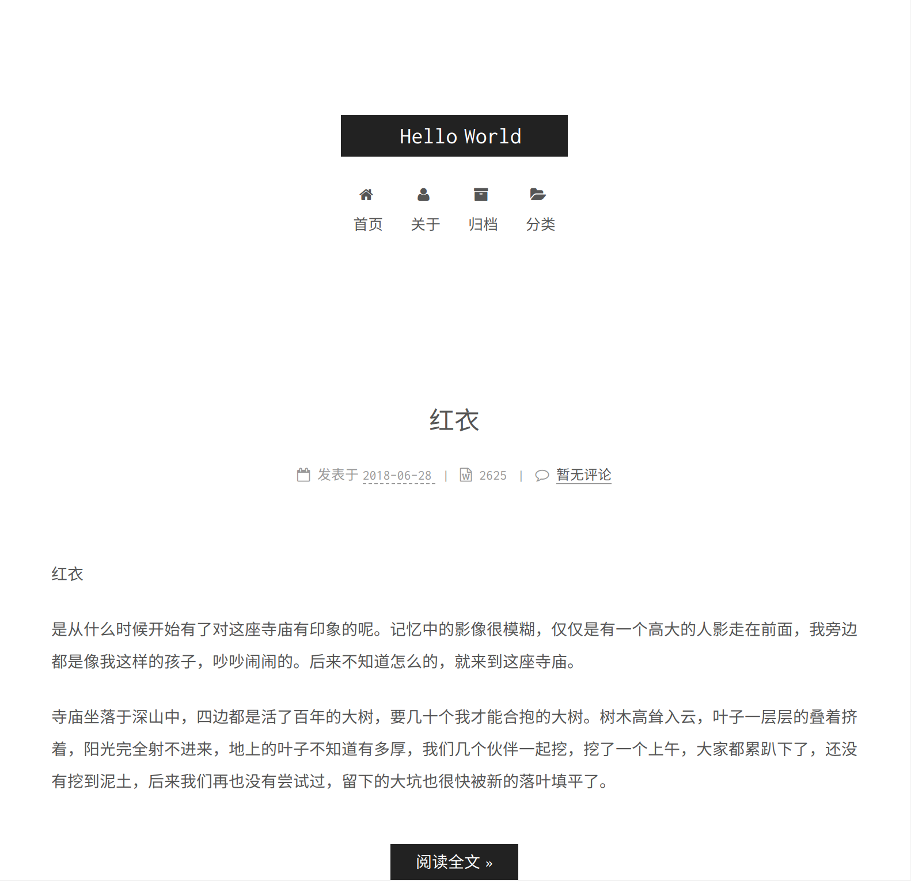

# typecho-theme-next

# 概述

基于typecho版的`Next.Mixt`修改而成，万分感谢。

简洁大方的 Hexo 主题 [Next.Muse](https://github.com/iissnan/hexo-theme-next) 的typecho移植版。

[预览](http://loliko.me)

NexT.Pisces传送门：[NexT.Pisces](https://github.com/newraina/typecho-theme-NexTPisces)
Next.Mixt传送门：[Next.Mixt](https://github.com/zgq354/typecho-theme-next)

## 使用方法

1. 点击 download zip 下载最新源码，解压，将其中文件夹重命名为 next 并上传至博客的 /usr/themes 目录下
2. 在博客后台点击启用
3. 新建分类页，缩略名为 categories ，自定义模板选择 categories 
4. 新建归档页，缩略名为 archive ，自定义模板选择 archive
5. 新建标签页，缩略名为 tags ，自定义模板选择 tags
6. 前往外观设置设置头像，昵称等等

## 最后
第一次写前端和php，有啥问题请提出来。

# License

Open sourced under the MIT license.
